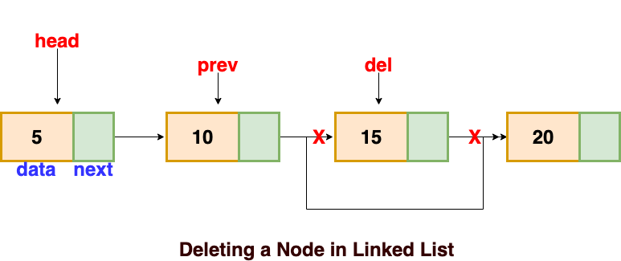

# The Logic Behind Removing a Node in a LinkedList

1. Checking if the List in Empty --> Throw an Error!

2. If the position given in the remove_item function is 1, we already have a function called "remove_from_front" so use that

3. If the position is greater than 1, then we traverse until you're at the Node before you wanna remove.

4. Set the pointer of the Node before the target Node to the Node after the target Node.

5. Delete the Node you want to remove and reduce the num_node count. 

## Diagram

### Source for Diagram and Logic for LinkedList Deletion:
https://afteracademy.com/blog/types-of-linked-list-and-operation-on-linked-list