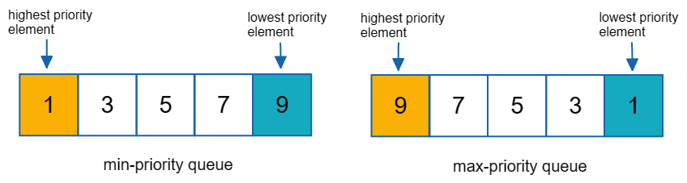

# Priority Queue Implementation
## This is our group's implementation of a Priority Queue where the Highest Priority is the LARGEST value.



### LinkedList Implementation: 
### Insertion Logic is quite simple, basically we're just looping until we find a node whose value is less than or equal to the item we want to insert. The new item is insert right before that node to maintain a descending order.


```cpp
#include "LinkedList.h"

template <class T>
class Queue : public LinkedList<T>
{
  public:
    // constructors
    Queue() = default;

    // modifiers
    void insert(T item) {
       if(empty()){
        LinkedList<T>::insert_at_front(item); // adding for an empty queue
        return; //without this return statement, the item would be added twice in an empty list!
       }
       int i = 1; // looping to check whether or not item is less than an element (basically, we want to loop until the next max)
       while(i <= LinkedList<T>::length() && item < LinkedList<T>::get_item_at(i)){
        i++;
       }
       LinkedList<T>::insert_item_at(item, i -1);
    }

    T remove() {
        if (empty()) {
            throw std::underflow_error("Can't remove from empty queue");
        }       
        return LinkedList<T>::remove_from_front();
    }

    bool empty() {
        return (LinkedList<T>::length() == 0);
    }

};
```

### Array Implementation:
### The logic for insertion is quite different from a LinkedList imlementation. We start fro the end of the array and shift it to the right until we find the correct positio where the item we want to inserti s less than or equal to an element in the array. Then we insert it into this "gap"

```cpp

#ifndef QUEUE_H
#define QUEUE_H
#define MAX_SIZE 1024
#include <stdexcept>

template <class T>
class Queue {
    int first;
    int last;
    T items[MAX_SIZE];

public:
    Queue() {
        first = 0;
        last = 0;
    }

    void insert(const T& value) {
        if ((last + 1) % MAX_SIZE == first) {
            throw std::overflow_error("No more space in queue");
        }
        int pos = last;
        while(pos > first && items[pos - 1] < value){
            items[pos] = items[pos - 1];
            pos--; // shifting the elements to the right until the correct spot is found
        }
        items[pos] = value;
        last++;
    }

    T remove() {
        if (empty()) {
            throw std::underflow_error("Can't remove from empty queue");
        }
        int oldfirst = first;
        first = (first + 1) % MAX_SIZE;
        return items[oldfirst];
    }

    bool empty() const {
        return first == last;
    }
};
#endif // QUEUE_H


```

